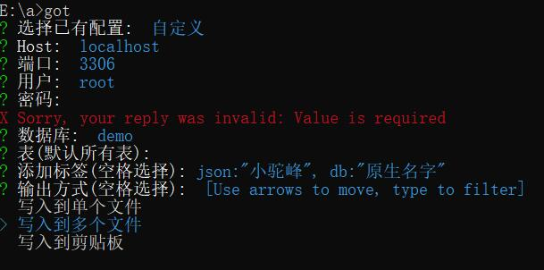

# got

连接mysql数据库，将表转换成go struct

## 下载安装

[链接](https://github.com/lhlyu/got/releases)


## 编译安装

#### 设置代理

```
- GO 1.13以上

> go env -w GOPROXY=https://goproxy.cn,direct

- macOS 或 Linux

> export GOPROXY=https://goproxy.cn

- windows && GO 1.11 + 

> set GOPROXY=https://goproxy.cn
```

#### 下载安装

> go get -u -v github.com/lhlyu/got/v2

#### 使用

> got

## 预览图



