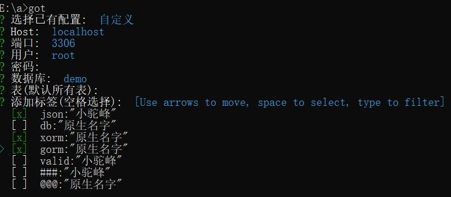

# got

连接mysql数据库，将表转换成go struct

## 安装

1. 设置代理

- GO 1.13以上

> go env -w GOPROXY=https://goproxy.cn,direct

- macOS 或 Linux

> export GOPROXY=https://goproxy.cn

- windows && GO 1.11 + 

> set GOPROXY = "https://goproxy.cn"

2. 下载安装

> go get -u -v https://github.com/lhlyu/got

3. 使用

> got

### 预览图

